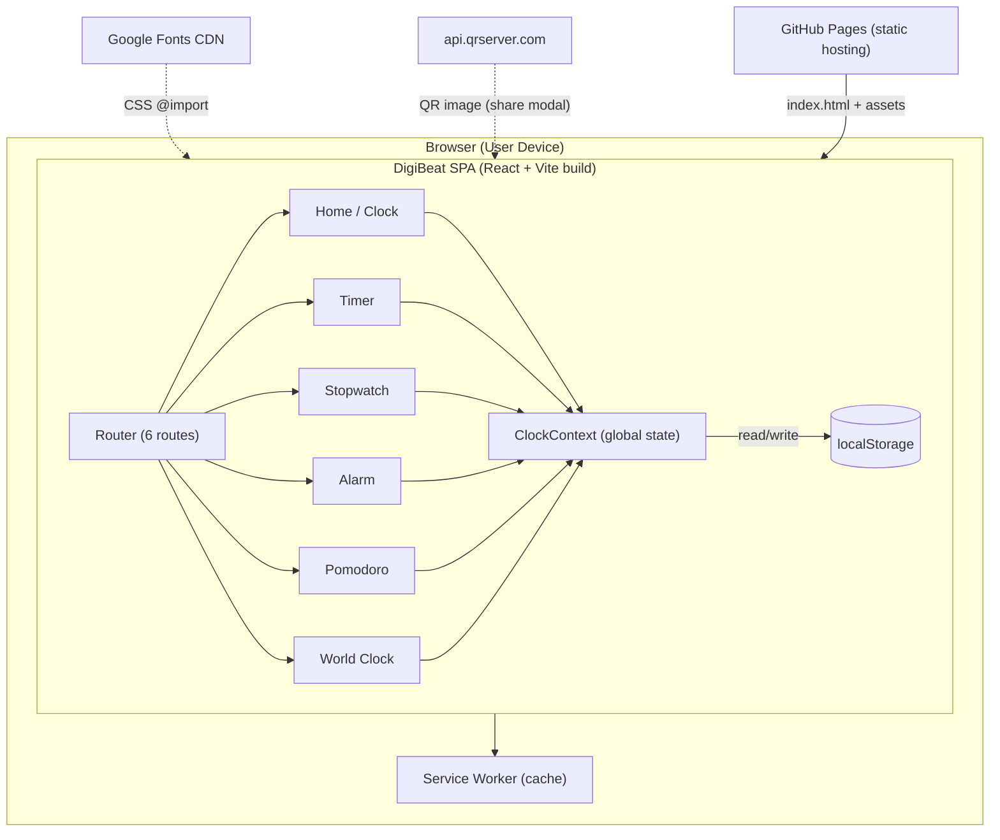
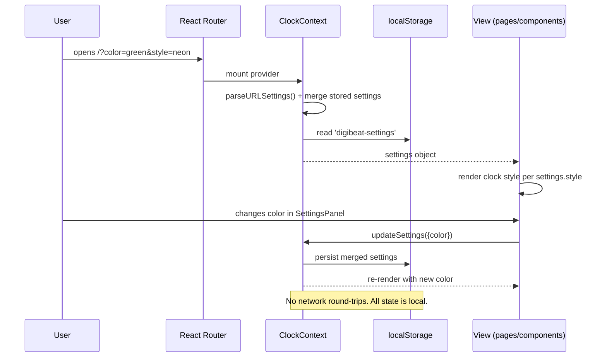
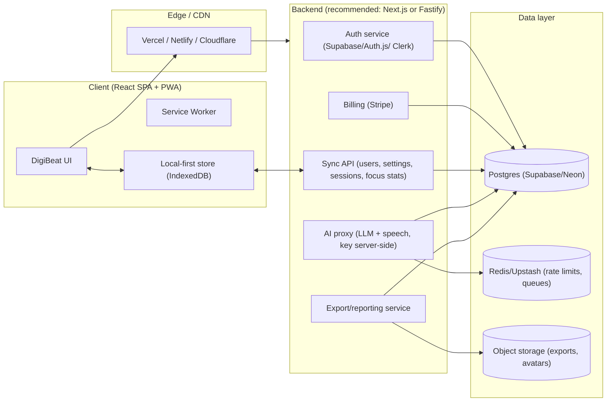
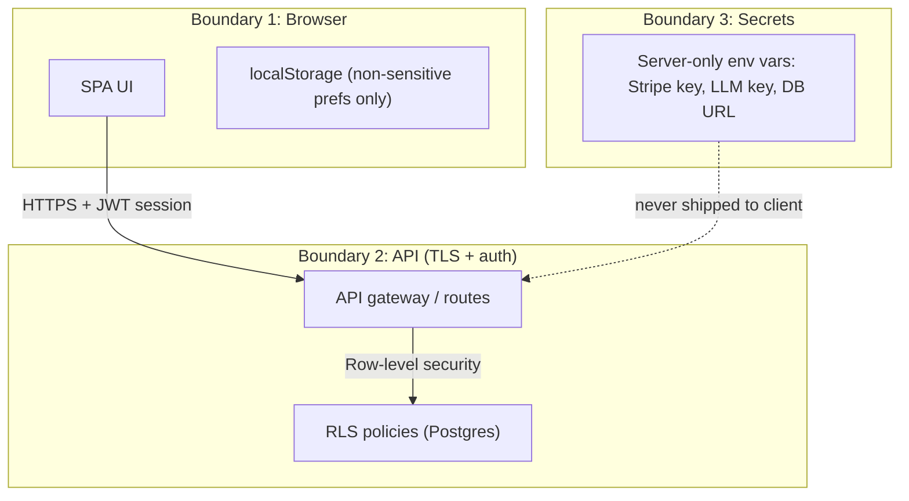

# DigiBeat — Architecture Documentation

> Status markers used throughout this document:
> - **EXISTING** — implemented in the current codebase (verified against source)
> - **PLANNED** — required next step, not yet built
> - **RECOMMENDED** — long-term target for scale/monetization

---

## 1. Executive Summary

DigiBeat is currently a **100% client-side single-page application (SPA)**. There is no
backend, no database, no authentication, no analytics, and no server-side code of any kind.
Everything — rendering, state, persistence, and even alarm scheduling — happens in the user's
browser. It is deployed as static files to GitHub Pages and is installable as a PWA.

This is both DigiBeat's greatest strength (zero infrastructure cost, instant load, offline-capable,
no signup friction) and its greatest limitation (no accounts, no cross-device sync, no billing,
no server-side logic, no way to know who users are).

---

## 2. Current Architecture (As-Built, Verified)

### 2.1 Technology Stack

| Layer | Technology | Version | Notes |
|---|---|---|---|
| UI framework | React | 18.3.x | Function components + hooks only |
| Language | TypeScript | 5.5.x | `strict` mode via `tsc -b` |
| Build tool | Vite | 5.4.x | `base: '/DigiBeat/'` (GitHub Pages) |
| Routing | react-router-dom | 6.26.x | `BrowserRouter` |
| State | React Context + hooks | — | Single global context (`ClockProvider`) |
| Persistence | `localStorage` | — | Two keys: `digibeat-settings`, `digibeat-alarms` |
| Offline | Service Worker | — | `public/sw.js` (stale-while-revalidate) |
| PWA manifest | `public/manifest.json` | — | Has known icon/start_url mismatches (see §7) |
| Sound | Web Audio API | — | Oscillator-based beeps (no audio assets) |
| Hosting | GitHub Pages | — | Static deploy via `gh-pages` script |
| Fonts | Google Fonts (Inter, Orbitron, Roboto Mono) | — | External runtime dependency |
| QR codes | `api.qrserver.com` | — | External third-party API call |

**Dependencies (`package.json`):** `react`, `react-dom`, `react-router-dom` only. No state
library, no UI kit, no HTTP client, no analytics, no test framework.

### 2.2 Component / Module Map

```
src/
├── main.tsx                  EXISTING  Entry point; registers service worker
├── App.tsx                   EXISTING  Router + ClockProvider wrapper
├── ClockContext.tsx          EXISTING  Global settings state, wake lock, auto-hide, URL parsing
├── types.ts                  EXISTING  All domain types + PRESETS/COLORS/CITIES constants
├── hooks/
│   └── useTime.ts            EXISTING  useTime, useTimer, useStopwatch, usePomodoro
├── components/
│   ├── Clocks.tsx            EXISTING  SimpleDigital, DigitalClockDisplay (unused), displays
│   ├── FlipClock.tsx         EXISTING  Flip clock with animation
│   ├── PixelClock.tsx        EXISTING  Bitmap font clock
│   ├── NeonClock.tsx         EXISTING  Neon glow + flicker clock
│   ├── BinaryClock.tsx       EXISTING  Binary-dot clock
│   ├── DateDisplay.tsx       EXISTING  DateDisplay + TimerDisplay + StopwatchDisplay
│   ├── Controls.tsx          EXISTING  FullscreenButton, WakeLockStatus, Button
│   ├── Navigation.tsx        EXISTING  Top nav (6 links)
│   ├── SettingsPanel.tsx     EXISTING  Settings drawer + ShareModal (QR)
│   ├── AlarmClock.tsx        EXISTING  Alarm CRUD, editor modal, sound
│   └── WorldClock.tsx        EXISTING  City picker, timezone display
├── pages/
│   ├── Home.tsx              EXISTING  Main clock + keyboard shortcuts
│   ├── Timer.tsx             EXISTING
│   ├── Stopwatch.tsx         EXISTING  Lap list
│   ├── Alarm.tsx             EXISTING
│   ├── Pomodoro.tsx          EXISTING  Fixed 25/5 (no long break logic)
│   └── WorldClockPage.tsx    EXISTING
├── sw.ts                     EXISTING  Service worker registration logic
└── styles.css                EXISTING  Global CSS + CSS variables theming
```

### 2.3 Current Architecture Diagram



### 2.4 Data Flow



### 2.5 External Dependencies (the only network calls)

| Dependency | Purpose | Risk |
|---|---|---|
| Google Fonts | 3 font families | Page renders with fallback fonts if blocked (no `display=swap` control) |
| `api.qrserver.com` | QR image in share modal | Third party sees the full share URL; fails offline; no privacy statement |
| GitHub Pages | Static hosting | No API, no server-side logic possible |

There is **no analytics, no error tracking, no telemetry** of any kind. The developers cannot
see how many people use DigiBeat or which features are used.

---

## 3. Architectural Patterns in Use (Current)

| Pattern | Where | Purpose | Verdict |
|---|---|---|---|
| Provider / Context | `ClockContext.tsx` | Share settings across all pages without prop drilling | Correct and appropriate for app-wide settings |
| Custom Hooks | `useTime.ts` | Encapsulate timer/stopwatch/pomodoro logic | Correct; testable |
| Strategy (switch on style) | `Home.tsx` `renderClock()` | Choose clock renderer by `settings.style` | Correct but grows poorly; consider registry |
| Configuration objects | `PRESETS`, `COLORS`, `CITIES` in `types.ts` | Data-driven UI | Correct; idiomatic |
| CSS Variables theming | `styles.css` + `data-bg` attributes | 4 themes via variable swap | Correct |
| Observer | `useEffect` + event listeners | Wake lock, online/offline, auto-hide, keyboard | Correct, but scattered |
| Repository-ish | localStorage read/write in two components | Persist settings + alarms | Ad-hoc; two separate keys, no schema |

---

## 4. Target Architecture (Recommended)

The recommended evolution is a **thin client + managed backend** — keep the SPA's instant,
offline-first character while adding accounts, sync, billing, and AI behind an API.



### 4.1 Recommended stack choices (with rationale)

| Concern | Recommendation | Why |
|---|---|---|
| Backend | **Supabase** (Postgres + Auth + Row Level Security) | Fastest path to auth + DB with zero ops; generous free tier |
| Billing | **Stripe** (Checkout + Customer Portal + webhooks) | Industry standard; portal handles cancellation/upgrades for free |
| AI | **OpenAI-compatible API** behind your own proxy route | Keep the LLM key server-side; one endpoint to swap providers |
| Hosting | **Vercel** (frontend + serverless functions) | Free tier, GitHub integration, global CDN; replace GitHub Pages |
| Analytics | **PostHog** (self-hostable) or Plausible | Product analytics + funnels; privacy-friendly option exists |
| Auth | Email magic link (Supabase) + optional OAuth | No password management burden |

### 4.2 Security boundaries



**Current security posture:** no secrets exist (nothing to protect), but also no abuse
protection, no rate limiting, no privacy controls, no data. The QR-share feature sends URLs
to a third party. When adding accounts, never move the LLM key or Stripe key into the client.

---

## 5. Persistence Strategy

### 5.1 Current (EXISTING)

| Store | Contents | Lifetime |
|---|---|---|
| `localStorage: digibeat-settings` | Full `ClockSettings` object (color, style, format, toggles, preset…) | Per-browser, forever |
| `localStorage: digibeat-alarms` | Alarm array with days, labels, enabled state | Per-browser, forever |

Limitations: not shared across devices, silently lost on browser data clear, no versioning
(a schema change can crash `JSON.parse` — currently only guarded with try/catch), no user
identity, no conflict resolution.

### 5.2 Target (RECOMMENDED)

| Stage | Change |
|---|---|
| Phase 2 | Add `settings_version`; migrate on read; extract a storage module with typed schema |
| Phase 3 | Introduce IndexedDB mirror for alarms/focus stats (survives longer, larger data) |
| Phase 4 | Cloud sync: push/pull JSON blobs with `updated_at` + last-write-wins, per-user row in Postgres |
| Phase 5 | Offline queue: mutations recorded locally, replayed on reconnect (crisp sync) |

---

## 6. Deployment & Environments (Recommended)

| Environment | Purpose | Hosting |
|---|---|---|
| Production | Public site | Vercel (or GitHub Pages until Phase 4) |
| Staging | Pre-release verification | Vercel preview deployment per PR |
| Local | Development | `npm run dev` (Vite on port 5173) |

CI/CD (PLANNED): GitHub Actions — `npm ci` → `tsc -b` → `vite build` → deploy on tag/merge
to `main`. Currently there is no CI at all.

---

## 7. Verified Defects & Tech Debt (Important Context)

These were confirmed by reading the source. They matter because they are the cheapest
"architecture improvements" available:

1. **PWA manifest icon mismatch** — `manifest.json` points to `/icon-192.png` and
   `/icon-512.png`, but the repo contains `icon-192.svg` and `icon-512.svg`. Install prompts
   will use fallback/no icon on many devices.
2. **Manifest `start_url: "/"`** vs Vite `base: '/DigiBeat/'` — on GitHub Pages the app is
   served under `/DigiBeat/`, so the install start URL is wrong.
3. **Dead code** — `DigitalClockDisplay` / `SevenSegmentDigit` in `Clocks.tsx` are exported
   but never imported; `Home.tsx` renders `SimpleDigital` instead. The `custom` background
   theme and `customBackground` setting exist in types but have no UI or URL path.
4. **README overclaims** — "Background Sync / Settings sync automatically" does not exist;
   "After 4 sessions, take a longer break" is not implemented (Pomodoro always uses a 5-min
   break and the session counter runs forever).
5. **Duplicate components** — `ToggleSwitch` is implemented twice (SettingsPanel.tsx and
   AlarmClock.tsx) with slightly different props and a11y behavior.
6. **Hook-in-callback smell** — `Home.tsx` calls `useClock()` inside `handleKeyDown`
   (works at runtime, but violates Rules of Hooks and confuses tooling).
7. **No `prefers-reduced-motion` respect in several inline animations** — several pages
   inject `@keyframes pulse` via `<style>` tags that the global reduced-motion media query
   does not fully cover (e.g., the Timer "TIME'S UP!" screen still animates).
8. **Hardcoded `en-US`** in `Intl`/`toLocaleString` calls (DateDisplay, WorldClock) — no i18n.
9. **No tests, no lint config beyond tsc, no CI.** The build is `tsc -b && vite build` only.
10. **Alarm snooze mutates the alarm time** (5-min "snooze" rewrites `alarm.time`), so
    snoozed alarms stop repeating correctly on their original schedule until next toggle.

---

## 8. Architecture FAQ (from the codebase perspective)

| Question | Answer |
|---|---|
| Is there a backend today? | No. Zero server-side code. |
| Is there a database? | No. `localStorage` only. |
| Is there authentication? | No. |
| External services? | Google Fonts, qrserver.com, GitHub Pages. |
| AI services? | None. No ML/AI libraries or API calls exist. |
| Can it scale to many users today? | Yes, trivially — there is no server to overload. But there is also no data, no accounts, no monetization surface. |
| What breaks first under growth? | Nothing technical; the *product* breaks: no way to retain, identify, sync, or charge users. |
