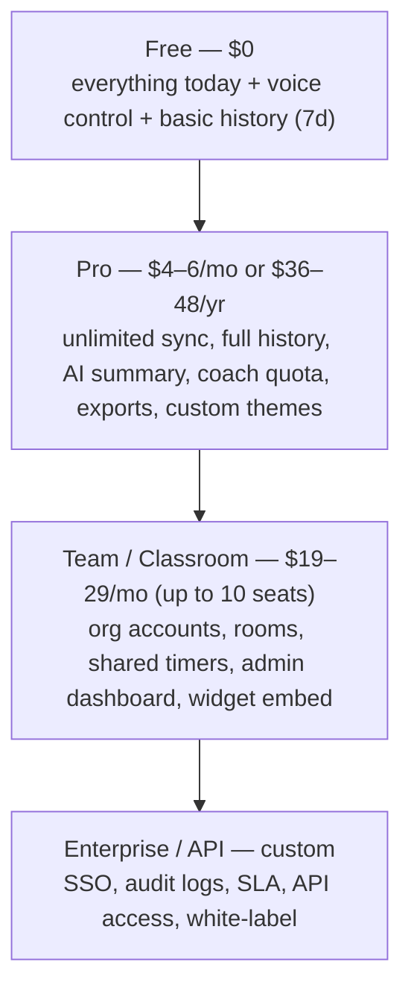

# DigiBeat — Monetization Strategy

> Reality check first: DigiBeat has no accounts, no backend, no billing, and no paid surface.
> Users have no reason to pay for a clock they can clone in 20 lines of CSS — **so the paid
> product cannot be "the clock."** The paid product must be the *data layer* (history, sync,
> insights, teams) wrapped around the clock. This document builds pricing on that principle.

---

## 1. What Is (and Is Not) Sellable

| DigiBeat asset | Sellable? | Why |
|---|---|---|
| The clock display itself | ❌ No | Free cloneable everywhere (online-stopwatch, every OS has one) |
| Timer/stopwatch/pomodoro | ❌ No | Commodity features; paywalling them kills the product |
| Cross-device sync | ✅ Yes (weak-moderate) | Real convenience; cheap to provide; standard SaaS anchor |
| Focus history + analytics | ✅ Yes (strong) | The only thing a plain clock *can't* do; habit/insight value |
| AI summaries & coach | ✅ Yes (strong) | Perceived value is high; genuine cost per user → natural paywall |
| Team/classroom organization | ✅ Yes (strongest B2B) | Rooms, shared timers, dashboards — managers pay for visibility |
| Embeddable widgets / white-label | ✅ Yes (moderate) | Recurring "per-site" revenue; low churn |
| API access | ✅ Yes (moderate) | Developer niche, usage-based |
| Branding/custom themes | ✅ Yes (weak) | Pro perk; not a driver |

---

## 2. Pricing Architecture (Recommended)

| Tier | Price | What's included | Target |
|---|---|---|---|
| **Free** | $0 | All current features; voice timer; 7-day rolling history; 1 device | Everyone — top of funnel |
| **Pro** | $4.99/mo · $39/yr (~35% off) | Unlimited sync, full history, AI weekly summary, AI coach (200 msg/mo), CSV/PDF export, custom backgrounds, no watermark on shares | Individual focus users |
| **Team/Classroom** | $24/mo flat (10 seats) + $2/extra seat | Everything in Pro for each member + rooms/shared timers, org dashboard, embeddable room widget, admin controls | Studios, schools, small teams |
| **Business/API** | $99–299/mo or usage | SSO, audit logs, 99.9% SLA, white-label embed, REST API with webhooks, bulk export | SaaS companies, agencies, enterprises |

### Pricing principles
1. **Free tier is generous** — the tool's shareability *is* the marketing engine.
2. **Paywall the data, not the tool** — history/sync/AI, never the stopwatch.
3. **Annual discount** to improve cash flow and retention (standard 30–40%).
4. **Team pricing by seat (or flat + overage)** — classrooms prefer flat; teams prefer seats.
5. **Usage-based only for API** — per 10k API calls or per integration host.

---

## 3. Revenue Feature Matrix

| Feature | Target User | User Value | Free/Paid | Difficulty | Revenue Potential |
|---|---|---|---|---|---|
| Voice timer/alarm control | All | High (friction removal) | Free | Low | Indirect (retention) |
| NL alarm/schedule parsing | All | Medium-High | Free (quota) / Pro | Low-Med | Low direct, high activation |
| Cross-device sync (settings+alarms) | Pro users | High | Pro | Medium | **Core Pro anchor** |
| Focus history (unlimited) | Focus users | High | Pro | Medium | **Core Pro anchor** |
| AI weekly summary | Focus users | High | Pro | Medium | **Core Pro anchor** |
| AI focus coach chat | Focus users | Medium-High | Pro (quota) | High | High (natural upsell) |
| Smart pomodoro (adaptive) | Focus users | Medium | Free | Medium | Indirect |
| Saved timer presets (named) | Power users | Medium | Free | Low | Indirect |
| CSV/PDF export & reporting | Students, coaches | Medium-High | Pro | Medium | Moderate |
| Custom/AI backgrounds | Aesthetic users | Medium | Pro | Low-Med | Low-Moderate |
| Streaks & goals | Habit users | Medium | Free | Low | Indirect (retention) |
| Team rooms & shared timers | Studios/schools | High | Team | High | **Highest B2B revenue** |
| Admin dashboard & usage reports | Managers/teachers | High | Team | High | High (B2B stickiness) |
| Embeddable room widget | Schools/sites | Medium-High | Team | Medium | Moderate recurring |
| White-label widget/embed | Agencies/sites | High | Business | Medium | High margin recurring |
| Public REST API | Developers | Medium | Business/usage | Medium | Moderate, usage-based |
| Web Push alarm delivery | All | High (trust) | Free (cap) / Pro | Medium | Indirect (retention) |
| No-watermark share pages | Streamers | Low-Med | Pro | Low | Low |
| SSO, audit logs, SLA | Enterprises | High | Business | High | High but long sales cycle |

---

## 4. Unit Economics (Illustrative)

| Metric | Value | Assumption |
|---|---|---|
| Free MAU | 10,000 | Plausible for a well-ranked PWA |
| Free → Pro conversion | 2–4% | Typical for productivity tools |
| Pro MRR | $1,000–2,000 | At $5 avg/mo (mix of monthly/annual) |
| Team accounts | 5–15 × $24 | 1–2 classrooms/studios early on |
| Gross margin | >90% | Server cost tiny; AI cost capped by Pro quotas |
| CAC | ~$0 (organic, share-driven) | If it needs ads, economics worsen sharply |
| Churn target | <5%/mo | History + sync = lock-in (switching cost) |

**Honest warning:** at 10k MAU the realistic first-year revenue is **$1–4k/month** — a solid
side-project income, not a startup. The B2B (team/widget) line is what changes the shape of
the curve, because a single school or agency contract can equal hundreds of Pro users.

---

## 5. Billing Infrastructure Requirements (PLANNED)

1. **Stripe Checkout** — one-time setup, hosted pages (no PCI scope).
2. **Stripe Customer Portal** — users manage/cancel subscriptions without you building UI.
3. **Webhooks** → `customer.subscription.updated/deleted` → update `users.plan` in DB.
4. **Entitlement checks** — server-side on every premium API call (never trust the client).
5. **Downgrade handling** — data retained but read-only for 90 days; export offered before
   deletion (privacy + goodwill).
6. **Tax** — Stripe Tax or Paddle (Paddle is better if selling EU-wide from day one).

---

## 6. What Should NEVER Be Paid

- Reading the time / basic clock styles (the entire current feature set)
- Timer, stopwatch, pomodoro core mechanics
- World clock basics
- Offline/PWA capability
- Accessibility features (contrast, reduced motion) — paywalling a11y is a reputational trap

---

## 7. Risks to Monetization (honest list)

| Risk | Severity | Mitigation |
|---|---|---|
| Clocks are a commodity — low willingness to pay | High | Sell data/insights/teams, not time display |
| Free alternatives (OS clocks, online-stopwatch, Google Timer) | High | Differentiate with focus analytics + AI + ambience |
| Users open the app rarely (low DAU) | High | Weekly summary email + push notifications create return visits |
| AI cost erosion | Medium | Quotas, caching, on-device AI first, mini models |
| Churn after novelty | Medium | History/sync lock-in; annual plans |
| B2B sales require features (rooms, roles, audit) | Medium | Ship Team tier only after 2–3 design partners confirm |
| PWA install prompts + manifest bugs hurt trust | Low | Fix in Phase 1 |
| Privacy concerns on time/screen data | Medium | Local-first storage, clear policy, deletion API |

---

## 8. The 3 Monetization Bets (in priority order)

1. **Pro subscription (sync + history + AI summary)** — the fastest path to first revenue;
   pricing is simple, churn is manageable, and it monetizes the retention engine itself.
2. **Team/Classroom tier (rooms + dashboard + widget)** — the highest-value-per-customer
   line; schools and studios pay for *visibility and control*, which individuals never will.
3. **White-label widget / Business API** — low-volume, high-margin recurring contracts;
   treat as a later-stage "productized service" once the widget exists for Team.
