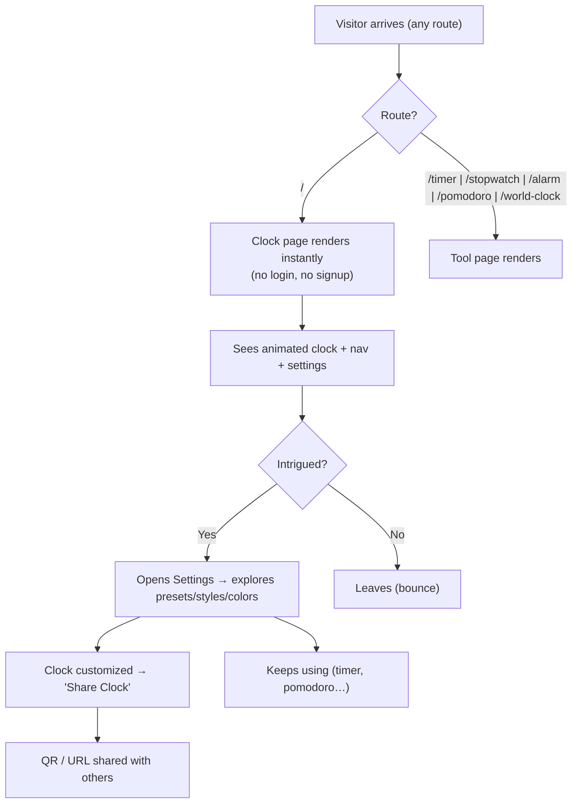
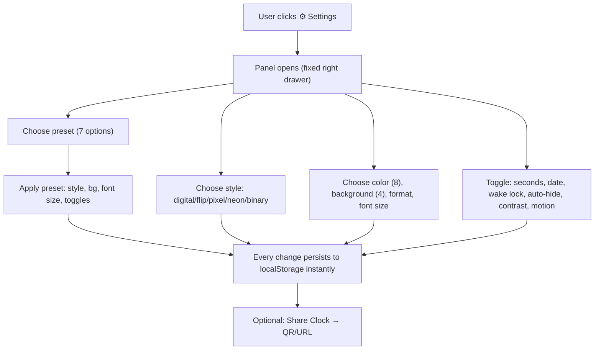
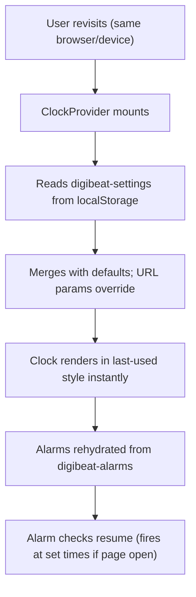
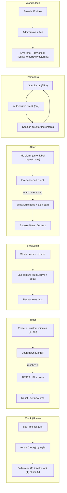
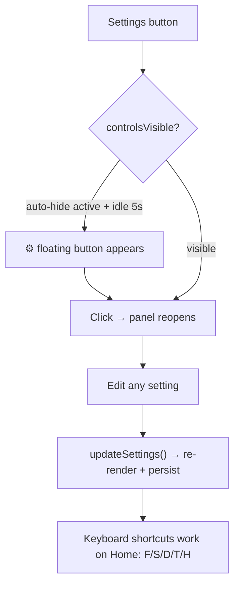
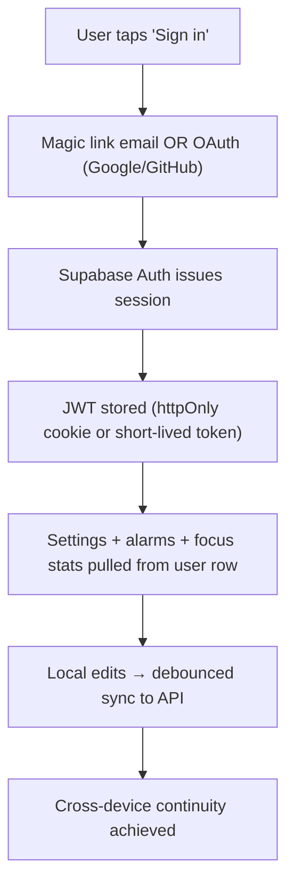
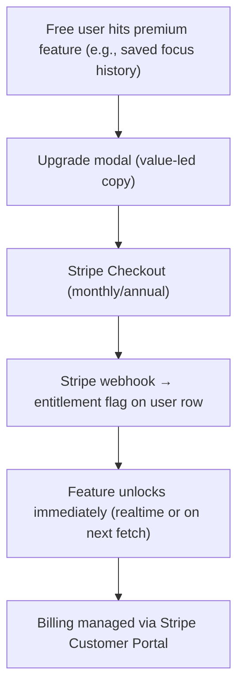
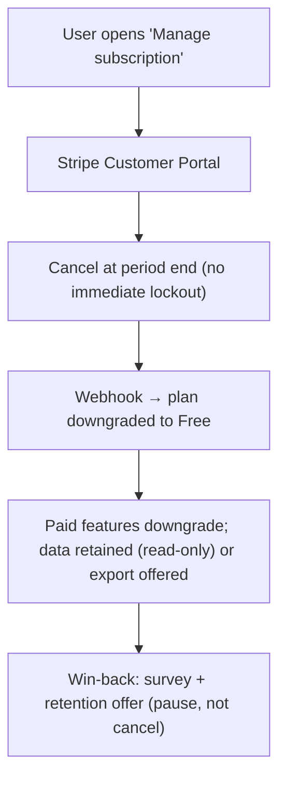

# DigiBeat — User Flow Documentation

> Status markers:
> - **EXISTING** — flow works today in the deployed app
> - **PLANNED** — designed, not built
> - **RECOMMENDED** — long-term target

---

## 1. Flow Inventory (Current)

| # | Flow | Status | Entry point | Exit point |
|---|---|---|---|---|
| F1 | New visitor (first page load) | EXISTING | Any URL | Starts using a tool or leaves |
| F2 | First-time configuration | EXISTING | Settings button | Clock customized, optionally shared |
| F3 | Returning user (same browser) | EXISTING | Any URL | Settings restored automatically |
| F4 | Clock display session | EXISTING | Home `/` | Fullscreen / offline / leave |
| F5 | Timer session | EXISTING | `/timer` | Completion ("TIME'S UP!") |
| F6 | Stopwatch session | EXISTING | `/stopwatch` | Laps recorded / reset |
| F7 | Alarm setup + trigger | EXISTING | `/alarm` | Alarm rings → snooze/dismiss |
| F8 | Pomodoro session | EXISTING | `/pomodoro` | Focus/break cycles |
| F9 | World clock comparison | EXISTING | `/world-clock` | City list customized |
| F10 | Settings change | EXISTING | Settings panel | Change applied + persisted |
| F11 | Share clock (URL + QR) | EXISTING | Share modal | URL copied / QR scanned |
| F12 | Authentication | PLANNED | — | — |
| F13 | Premium upgrade | PLANNED | — | — |
| F14 | Subscription management/cancel | PLANNED | — | — |

---

## 2. Flow Diagrams

### 2.1 New Visitor (EXISTING)

**Friction points (verified):** no onboarding, no "what is this" copy, no account incentive,
no call to action, no analytics to know where visitors drop.

### 2.2 First-Time Configuration (EXISTING)

### 2.3 Returning User (EXISTING)

**Limitations:** on a new device or after clearing storage, the user starts from scratch.
There is no account to restore state. Alarms only fire while the tab/app is open and the
device is awake — no push notifications exist.

### 2.4 Main Feature Usage

### 2.5 Settings (EXISTING)

### 2.6 Authentication (PLANNED)

Design intent: **auth is optional**. Anonymous use stays fully functional; sign-in unlocks
sync, history, and premium features. This preserves the zero-friction character of the tool.

### 2.7 Premium Upgrade (PLANNED)

### 2.8 Subscription Cancellation (PLANNED)

---

## 3. User Experience Observations (Verified)

### 3.1 What works well

- **Instant, frictionless start** — no signup, no loading screens, works offline.
- **Consistent visual language** — one neon/glassmorphism aesthetic across all tools.
- **Keyboard-first clock** — shortcuts make the ambient display usable from a distance.
- **Presets** compress a 15-option config into one tap (strong onboarding device).
- **PWA + fullscreen + wake lock** — the "ambient display" use case is genuinely solved.

### 3.2 What hurts retention (honest assessment)

1. **No reason to return.** A clock/timer is a *session* tool, not a *habit* tool. Without
   history, streaks, saved timers, or sync, there is no pull back.
2. **No cross-device continuity.** Everything lives in one browser's localStorage.
3. **Alarms are unreliable as an alarm.** They fire only when the page is open and the
   screen awake — no notifications, no background delivery.
4. **No feedback loop.** The developer cannot see sessions, so the product cannot improve.
5. **World Clock and Pomodoro are fixed-config.** Pomodoro cannot set work/break durations
   or long breaks; World Clock city list resets per browser.
6. **No export.** Focus history, laps, and settings can't be exported or shared as data.
7. **Language/UX hardcoded to English** and en-US locale.

### 3.3 Recommended future flows (priority order)

| Flow | Status | Why |
|---|---|---|
| Anonymous → signed-in upgrade path | PLANNED | Unlocks sync/history/billing without hurting adoption |
| Focus session history + weekly summary | PLANNED | Creates the "return" loop |
| Saved timer presets (named) | PLANNED | Removes setup friction for the most common action |
| Web Push alarm delivery | RECOMMENDED | Makes the alarm feature actually trustworthy |
| Onboarding tour (3 steps) | RECOMMENDED | Reduces drop-off on first visit |
